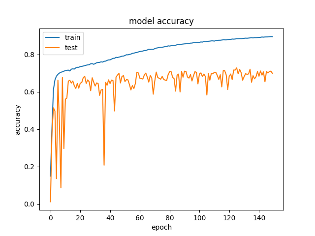
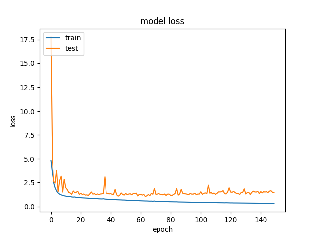

### The One Hundred Layers Tiramisu: Fully Convolutional DenseNets for Semantic Segmentation:
---

*Work In Progress, Results can't be replicated yet with the models here*
* UPDATE: April 28th: Skip_Connection added thanks to the reviewers, check model `model-tiramasu-67-func-api.py`

` feel free to open issues for suggestions:)`

* Keras2 + TF used for the recent updates, which might cause with some confilict from previous version I had in here

What is The One Hundred Layers Tiramisu?

* A state of art (as in Jan 2017) Semantic Pixel-wise Image Segmentation model that consists of a fully deep convolutional blocks with downsampling, skip-layer then to Upsampling architecture. 
* An extension of DenseNets to deal with the problem of semantic segmentation.

 **Fully Convolutional DensNet** = **(Dense Blocks + Transition Down Blocks)** + **(Bottleneck Blocks)** + **(Dense Blocks + Transition Up Blocks)** +  **Pixel-Wise Classification** layer

 

##### *[The One Hundred Layers Tiramisu: Fully Convolutional DenseNets for Semantic Segmentation (Simon Jégou, Michal Drozdzal, David Vazquez, Adriana Romero, Yoshua Bengio) arXiv:1611.09326 cs.CV](https://arxiv.org/abs/1611.09326)*
 	
#### Requirements:
-----

* Keras==2.0.2
* tensorflow-gpu==1.0.1
* or just go ahead and do: `pip install -r requirements.txt`

#### Model Strucure:
-----

* DenseBlock: 
	`BatchNormalization` + `Activation [ Relu ]` + `Convolution2D` + `Dropout` 

* TransitionDown: 
	`BatchNormalization` + `Activation [ Relu ]` + `Convolution2D` + `Dropout` + `MaxPooling2D`

* TransitionUp: 
	`Deconvolution2D` (Convolutions Transposed)

 

-----

#### Model Params:
-----

* RMSprop is used with Learnining Rete of 0.001 and weight decay 0.995
	* However, using those got me nowhere, I switched to SGD and started tweaking the LR + Decay myself.
* There are no details given about BatchNorm params, again I have gone with what the Original DenseNet paper had suggested.
* Things to keep in mind perhaps:
	* the weight inti: he_uniform (maybe change it around?)
	* the regualzrazation too agressive?

### Repo (explanation):
---

* Download the CamVid Dataset as explained below:
	* Use the `data_loader.py` to crop images to `224, 224` as in the paper implementation.
* run `model-tiramasu-67-func-api.py` or `python model-tirmasu-56.py` for now to generate each models file.
* run `python train-tirmasu.py` to start training:
	* Saves best checkpoints for the model and `data_loader` included for the `CamVidDataset`
* `helper.py` contains two methods `normalized` and `one_hot_it`, currently for the CamVid Task

### Dataset:
---

1. In a different directory run this to download the [dataset from original Implementation](https://github.com/alexgkendall/SegNet-Tutorial).
	* `git clone git@github.com:alexgkendall/SegNet-Tutorial.git`
	* copy the `/CamVid` to here, or change the `DataPath` in `data_loader.py` to the above directory
2. The run `python data_loader.py` to generate these two files:
	
	* `/data/train_data.npz/` and `/data/train_label.npz`
	* This will make it easy to process the model over and over, rather than waiting the data to be loaded into memory.

----

* Experiments:

	  
	  
| Models        | Acc           | Loss  | Notes |
| ------------- |:-------------:| -----:|-------|
| FC-DenseNet 67|  |  | 150 Epochs, RMSPROP

### To Do:
----

	[x] FC-DenseNet 103
	[x] FC-DenseNet 56
	[x] FC-DenseNet 67
	[ ] Replicate Test Accuracy CamVid Task
	[ ] Replicate Test Accuracy GaTech Dataset Task
	[ ] Requirements

* Original Results Table:

	 

	